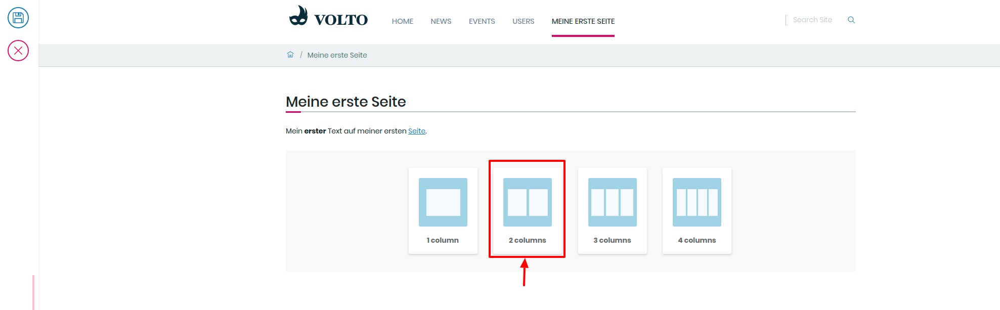

## 10. Übung: Bestehende Inhaltselemente auf Überssichtsseite einblenden

1. Loggen Sie sich ein und navigieren Sie zu ihrem persönlichen Ordner

2. Erstellen Sie eine neue Seite in ihrem persönlichen Ordner

3. Erstellen Sie einen neuen Block durch Drücken der Enter-Taste

4. Klicken Sie auf das “+”-Symbol, danach auf das “Proxy-Block”-Symbol

5. Klicken Sie im neu erstellten Block auf “Zwei Elemente” (2 columns)

6. Klicken Sie auf das “Ordner”-Symbol in der Block-Einstellungen-Leiste

7. Wählen Sie eine Nachricht in dem “Nachrichten”-Ordner aus (z.B. “/de/nachrichten/nachricht1”)

8. Wählen Sie eine zweite Nachricht aus

9. Klicken Sie in der Bearbeitungsleiste auf Speichern
   0
