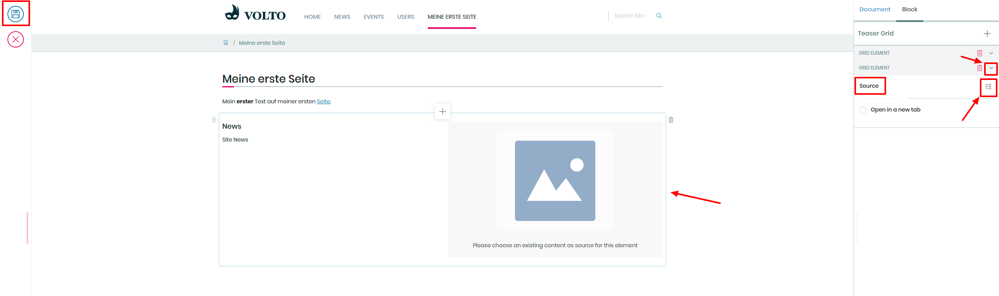

## 9. Übung: Bestehende Inhaltselemente auf Überssichtsseite einblenden

1. Erstellen Sie eine neue Seite

2. Erstellen Sie einen neuen Block

3. Klicken Sie auf das “+”-Symbol, danach auf das “Proxy-Block”-Symbol

4. Klicken Sie im neu erstellten Block auf “Zwei Elemente” (2 columns)

5. Klicken Sie auf das “Ordner”-Symbol in der Block-Einstellungen-Leiste

6. Wählen Sie eine Nachricht in dem “Nachrichten”-Ordner aus (z.B. “/de/nachrichten/nachricht1”)

7. Wählen Sie eine zweite Nachricht aus

8. Klicken Sie in der Bearbeitungsleiste auf Speichern
