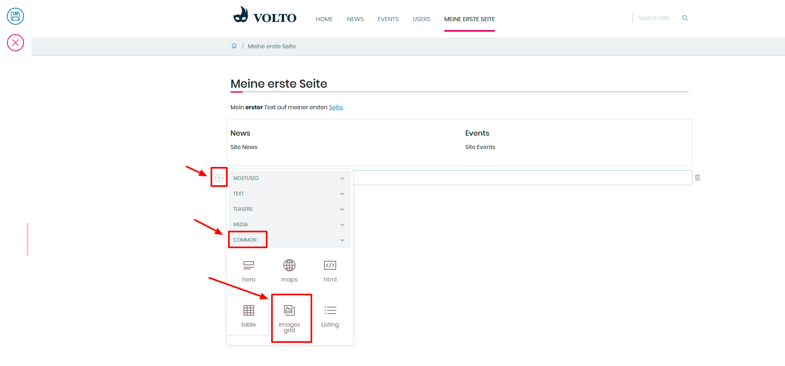
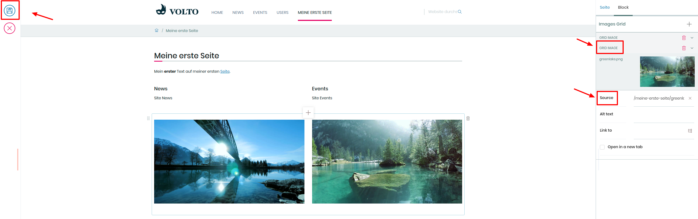

## 11. Übung: Übersichtsseite erstellen

1. Erweitern Sie die in Übung 10 erstellte Seite durch die folgenden Elemente

2. Klicken Sie auf das “+”-Symbol, danach auf das “Bild-Block”-Symbol

3. Klicken Sie im neu erstellten Block auf “Zwei Elemente”

4. Klicken Sie auf das “Ordner”-Symbol in der Block-Einstellungen-Leiste

5. Wählen Sie ein Bild aus dem “Bilder”-Ordner aus (z.B. “/de/user1/bilder/bild1”)

6. Wählen Sie eine zweites Bild aus

7. Klicken Sie in der linken Bearbeitungsleiste auf Speichern
