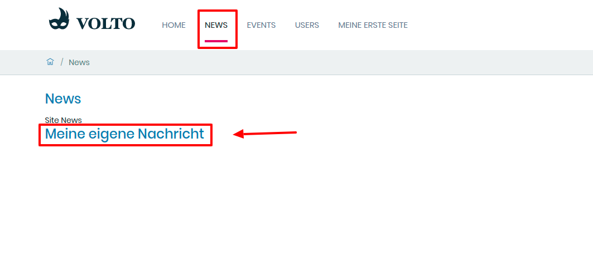

## 13. Übung: Nachricht erstellen

1. Erstellen Sie eine neue Seite

2. Fügen Sie einen Text und ein Bild hinzu

3. Vergeben Sie das Schlagwort “Nachricht” in der rechten Spalte

4. Speichern Sie die Seite

5. Ihre Nachricht sollte in dem “Nachrichten”-Bereich der Webseite auftauchen (https://internet.fzj.kitconcept.io/de/nachrichten)

