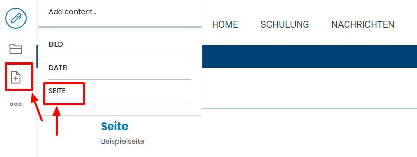
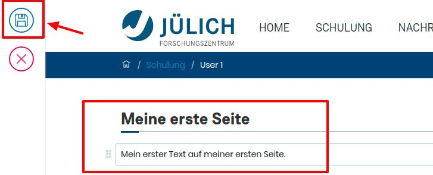

## 3. Übung: Seite erstellen

1. Loggen Sie sich auf https://volto.kitconcept.com/ &nbsp ein   (siehe Übung 1)  

2) Klicken Sie auf das "+"-Symbol in der Bearbeitungsleiste und wählen Sie im Auswahlmenü "Seite" aus

3. Geben Sie einen Titel in die erste Zeile ein

4. Geben Sie einen Text in die zweite Zeile ein

5. Speichern Sie das Dokument indem Sie auf das "Speichern"-Symbol in der Bearbeitungsleiste klicken

