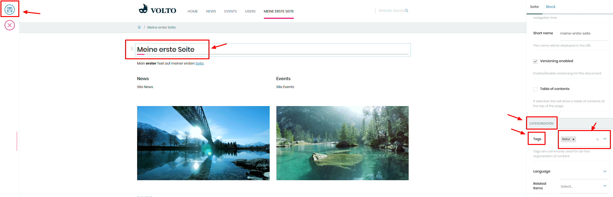
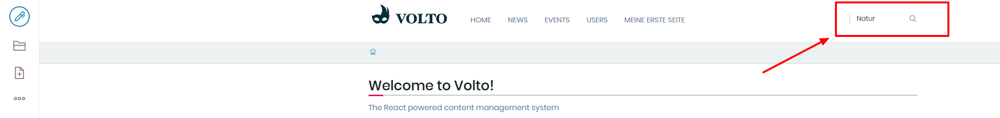

## 12. Übung: Verschlagwortung

1. Erstellen Sie eine neue Seite

2. Klicken Sie den Titel der Seite an

3. Wählen Sie in der rechten Spalte ein beliebiges Schlagwort aus (z.B. “Technik”)

4. Speichern Sie die Seite

5. Suchen Sie nach dem vergebenen Schlagwort in der Seitensuche

6. Das von Ihnen erstellte Dokument sollte in der Suche auftauchen

