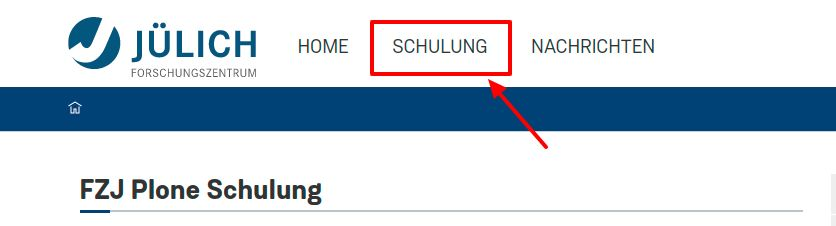
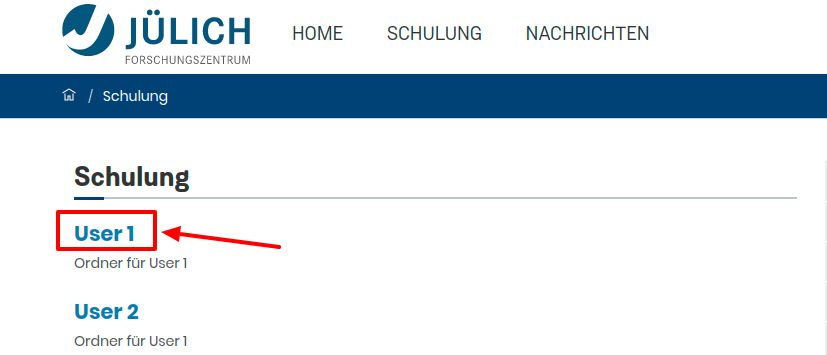

## 2. Übung: Seite editieren

1. Loggen Sie sich auf https://internet.fzj.kitconcept.io/ ein (siehe Übung 1)

2. Navigieren Sie zu dem Punkt "Schulung":
   https://internet.fzj.kitconcept.io/de/schulung

3. Klicken Sie auf ihren Nutzerordner (z.B. "User 1") in der Auflistung

4. Klicken Sie in der linken Menüleiste auf das "Edit"-Icon

5. Ändern Sie Titel und Text der Seite

6. Klicken Sie in der Bearbeitungsleiste auf das "Speichern"-Icon

