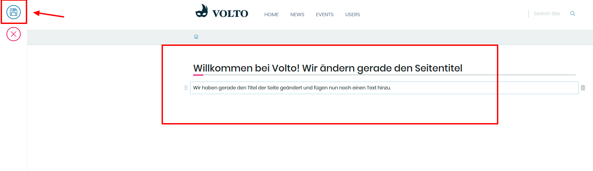

## 2. Übung: Seite editieren

1. Loggen Sie sich auf https://internet.fzj.kitconcept.io/ ein (siehe Übung 1)

2. Navigieren Sie zu der Seite, die Sie bearbeiten möchten 
   Im Folgenden wird hier die Startseite editiert

3. Klicken Sie in der linken Menüleiste auf das "Edit"-Icon

4. Ändern Sie Titel und Text der Seite

5. Klicken Sie in der Bearbeitungsleiste auf das "Speichern"-Icon

