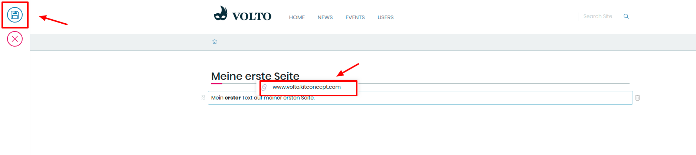

## 5. Übung: Externe Links

1. Loggen Sie sich ein

2. Gehen Sie zu der von ihnen erstellten Seite

3. Markieren Sie einen beliebigen Teil des Textes

4. Wählen Sie "Link" im Auswahlmenü aus 
   Der dazugehörige Button ist das Kettenglied

5. Geben Sie einen externen Link ein (z.B.: www.google.de)

6. Speichern Sie ihre Seite

7. Klicken Sie auf den von ihnen erstellten Link
