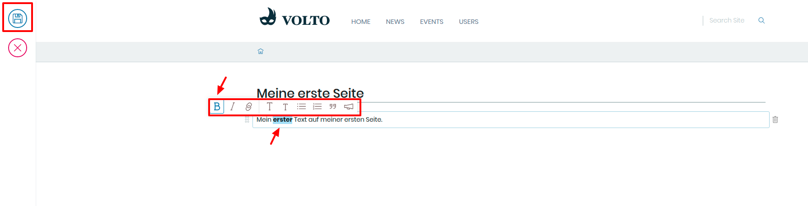

## 4. Übung: Text formatieren

1. Loggen Sie sich ein

2. Navigieren Sie zu einer Seite ihrer Wahl

3. Markieren Sie einen beliebigen Teil des Textes

4. Wählen Sie "fett" im Auswahlmenü aus  
   Das zugehörige Symbol ist das "B"

5. Weitere Möglichkeiten ihren Text zu formatieren sind:

   - Kursivschrift
   - Links setzen
   - Überschriften setzen
   - Listen erstellen
   - Zitate
   - Ausrufe

6. Speichern Sie ihre Seite
