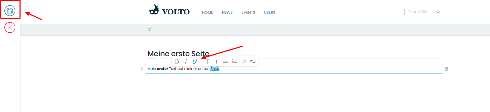

## 6. Übung: Interne Links

1. Loggen Sie sich ein

2. Gehen Sie zu der von ihnen erstellten Seite

3. Markieren Sie einen beliebigen Teil des Textes

4. Wählen Sie erneut "Link" im Auswahlmenü aus

5. Geben Sie die ersten beiden Buchstaben eines bestehenden Inhalts ein (z.B.:"Na")

6. Wählen Sie im Auswahlmenü ein Element aus (z.B."Nachricht)

7. Speichern Sie das Dokument

8. Klicken Sie auf den von ihnen erstellten Link

### Zusatzübung: Links löschen

Löschen Sie den von ihnen erstellten Link, indem Sie den Link erneut markieren und dann das Link-Icon abwählen.
