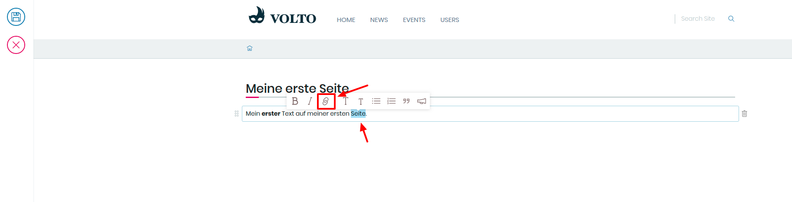

## 8. Übung: Ein bestehendes Bild auf einer Seite einbinden

1. Erstellen Sie eine neue Seite

2. Erstellen Sie einen neuen Block 
   Wählen Sie dazu den letzten Textblock aus und Drücken Sie die Enter-Taste

3. Wählen Sie das Kamera-Symbol im Auswahlmenü aus

4. Klicken Sie auf das “Ordner”-Symbol, danach sollte sich die rechte Bearbeitungsleiste öffnen

5. Wählen Sie ein bestehendes Bild aus

6. Positionieren Sie das Bild links/rechts/mittig

7. Speichern Sie das Dokument
