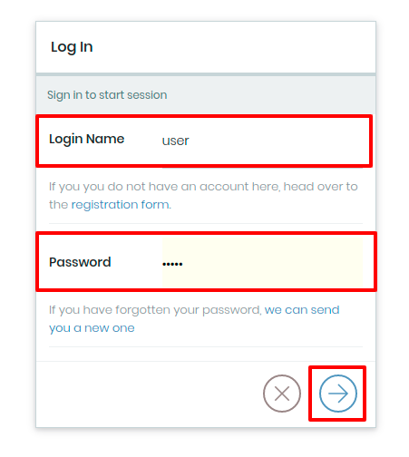

## 1. Übung: Einloggen

1. Gehen Sie auf https://volto.kitconcept.com
2. Klicken Sie rechts oben im Header auf den "Login"-Button

3. Geben Sie ihren Benutzernamen und ihr Passwort ein

4. Wenn Sie sich erfolgreich eingeloggt haben, sehen Sie auf der linken Seite die Bearbeitungsleiste

- Mit dem Stift-Button bearbeiten Sie die gerade aufgerufene Seite
- Der Ordner-Button zeigt ihnen die Seitenstruktur
- Mit dem Plus-Symbol können Sie neue Inhalte hinzufügen
- Einstellungen zum Publizieren der Inhalte finden sie unter den drei Punkten
- Der Button unten in der Leiste führt zu ihrem Profil
