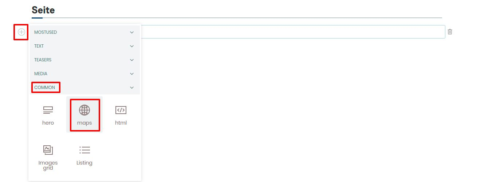
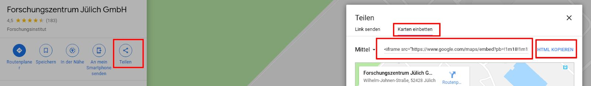
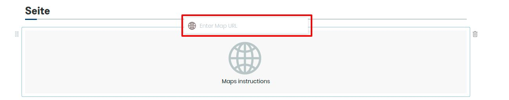

## Anhang: Maps-Block

1. Erstellen Sie eine neue Seite

2. Fügen Sie einen Maps-Block hinzu

3. Geben Sie eine gültige Maps HTML-URL ein

4. Bestätigen Sie die Eingabe mit der Enter-Taste

5. Speichern Sie die Seite
