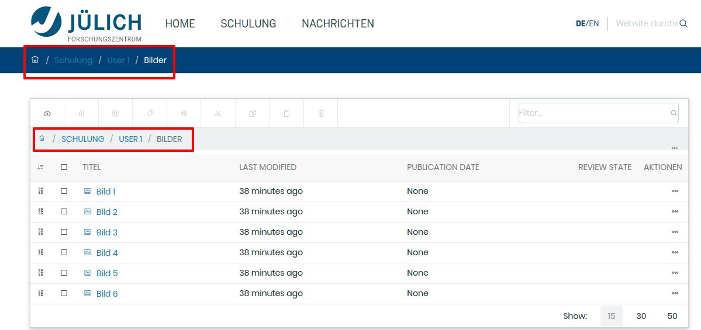
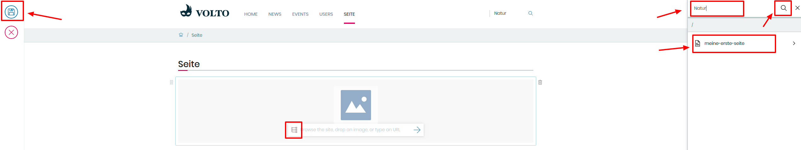

## 11. Übung: Bilder über Schlagwörter finden

1. Auf ihrer Seite existiert ein Ordner “Bilder”, welcher fünf Bilder enthält, denen verschiedene Schlagworte zugewiesen sind

2. Erstellen Sie eine neue Seite

3. Fügen Sie einen neuen Bild-Block hinzu

4. Klicken Sie in der rechten Spalte auf das “Suchen”-Symbol

5. Suchen Sie nach einem Schlagwort (z.B. “Natur”)

6. Wählen Sie in der Auswahlliste ein Bild aus

7. Speichern Sie ihre Seite in der linken Bearbeitungsleiste
