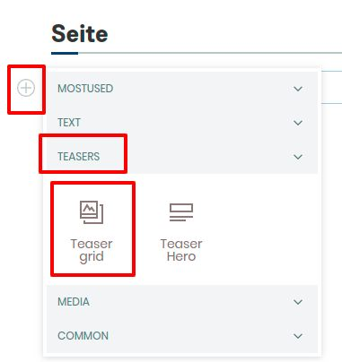
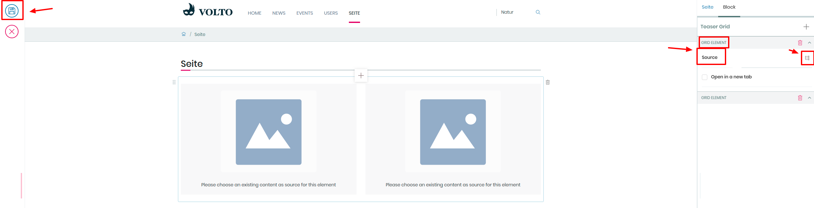

## Anhang: Teaser-Grid

1. Erstellen Sie eine neue Seite

2. Fügen Sie einen Teaser-Grid hinzu

3. Wählen Sie “2 columns” aus

4. Fügen Sie jeweils zwei verschiedene Inhalte in die columns ein. In der rechten Sidebar können Sie die Quelle auswählen

5. Speichern Sie die Seite
