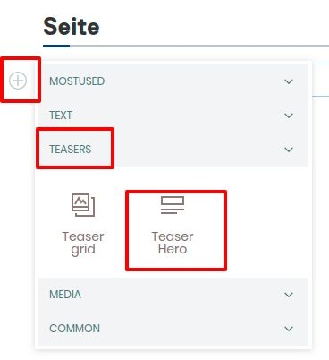
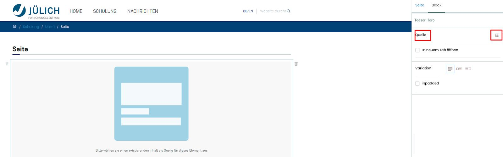

## Anhang: Teaser-Hero

1. Erstellen Sie eine neue Seite

2. Fügen Sie einen Teaser-Hero hinzu

3. Entscheiden Sie Sich für eine Zentrierung

4. Wählen Sie in der rechten Leiste eine Quelle für den Teaser-Hero aus

5. Speichern Sie die Seite
