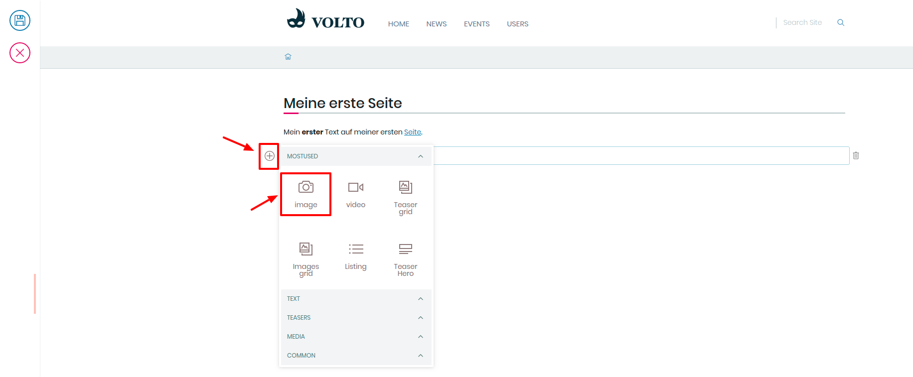
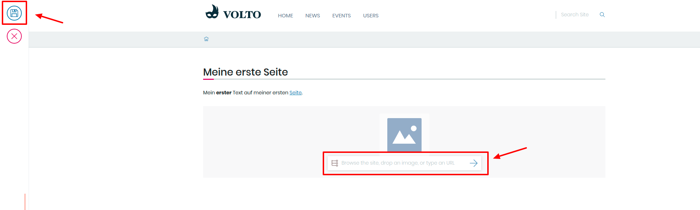
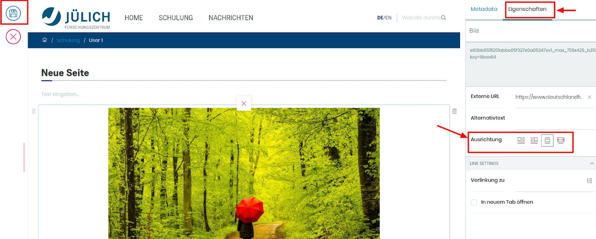

## 7. Übung: Bild auf einer Seite hochladen

1. Erstellen Sie eine nue Seite in ihrem persönlichen Ordner

2. Wählen Sie den letzten Textblock aus und drücken Sie die Enter-TAste

3. Wählen Sie das Kamera-Symobl im Auswahlmenü aus

4. Laden Sie ein Bild hoch (auch per Drag&Drop möglich)

5. Positionieren Sie das Bild links/recchts/mittig/volle Breite

6. Speichern Sie ihre Seite

