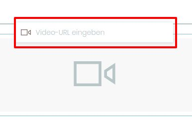

## Anhang: Video-Block

1. Erstellen Sie eine neue Seite

2. Fügen Sie einen Video-Block hinzu

3. Geben sie einen gültigen Youtube-Link in das URL-Feld ein

4. Bestätigen Sie die Eingabe mit der Enter-Taste

5. Speichern Sie die Seite
